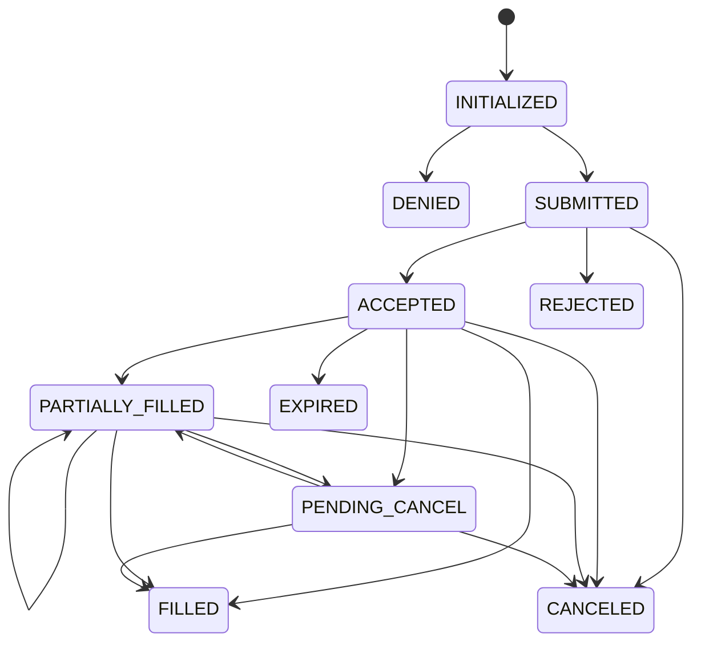

# OnlyAlpha Pure Financial Domain Model

## 1. 设计目标

Domain 是 OnlyAlpha 最内层、长期稳定的金融语言。Engine、Backtest、Live、Research、Web、Gateway 和 Storage 都依赖它；Domain 不反向依赖任何这些模块。

原则：市场中立、显式单位与币种、不可变优先、强类型 ID、构造即合法、无隐式 FX、无二进制 float、版本化 Instrument、状态转换显式、序列化可迁移。

## 2. 模块与依赖

```text
domain.errors
domain.base             schema_version / JSON / database record
domain.enums            市场中立枚举
domain.value            Decimal 金融值对象
domain.identifiers      强类型 ID
domain.instrument       版本化 Instrument 规格
domain.execution        OrderRequest / Order / Trade
domain.account          Position / Account / Portfolio / PnL
domain.market           Tick / Bar / OrderBook
domain.calendar         TradingCalendar / Session
domain.market_rules     Lot/Settlement/Tick/Fee/Calendar 组合规则
domain.catalog          effective-dated Instrument 查询
```

禁止导入：engine、runtime、cluster、gateway、web、database、cache、event、backtest、live、research。边界由 AST 测试强制。

## 3. 完整关系 UML

```mermaid
classDiagram
    OnlyInstrumentId *-- OnlySymbol
    OnlyInstrumentId *-- OnlyVenueId
    OnlyInstrument --> OnlyCurrency : base/quote/settlement/margin
    OnlyInstrument --> OnlyPrice : tick_size
    OnlyInstrument --> OnlyQuantity : step_size/limits/lot
    OnlyInstrument --> OnlyMultiplier : contract_multiplier
    OnlyInstrument <|-- OnlyEquity
    OnlyInstrument <|-- OnlyETF
    OnlyInstrument <|-- OnlyFund
    OnlyInstrument <|-- OnlyFuture
    OnlyInstrument <|-- OnlyOption
    OnlyInstrument <|-- OnlyIndex
    OnlyInstrument <|-- OnlyCommodity
    OnlyInstrument <|-- OnlyFxPair
    OnlyInstrument <|-- OnlyCryptoSpot
    OnlyFuture <|-- OnlyCryptoFuture
    OnlyInstrument <|-- OnlyCryptoPerpetual
    OnlyInstrument <|-- OnlySyntheticInstrument

    OnlyOrderRequest --> OnlyInstrumentId
    OnlyOrderRequest --> OnlyOrderId
    OnlyOrderRequest --> OnlyAccountId
    OnlyOrderRequest --> OnlyClusterId
    OnlyOrder *-- OnlyOrderRequest
    OnlyTrade --> OnlyOrderId
    OnlyTrade --> OnlyTradeId
    OnlyTrade --> OnlyPrice
    OnlyTrade --> OnlyQuantity
    OnlyTrade --> OnlyMoney : commission

    OnlyPosition --> OnlyPositionId
    OnlyPosition --> OnlyInstrumentId
    OnlyPosition --> OnlyPnL
    OnlyAccount *-- OnlyBalance
    OnlyAccount *-- OnlyPosition
    OnlyAccount --> OnlyAccountEquity
    OnlyPortfolio *-- OnlyAccount

    OnlyTick --> OnlyInstrumentId
    OnlyBar --> OnlyInstrumentId
    OnlyOrderBook *-- OnlyOrderBookLevel
    OnlyTradingCalendar *-- OnlyTradingSession
```



逻辑流不是对象依赖链：Instrument 定义合法交易规格；OrderRequest 表达意图；Order 表达委托状态；Trade 是成交事实；Position 由 Trade 聚合；Account 包含按币种 Balance 和 Position；Portfolio 聚合 Account，但跨币种换算必须在外层显式完成。

## 4. 值对象

| 对象 | 字段 | 约束 |
|---|---|---|
| `OnlyCurrency` | code, precision, currency_type | code 2–12 位大写字母数字；precision 0–18 |
| `OnlyPrice` | value, precision | Decimal、有限、允许负值以覆盖价差/特殊市场；不含 tick |
| `OnlyQuantity` | value, precision | Decimal、有限、非负；不含 step |
| `OnlyMoney` | amount, currency | Decimal 精度不超过 Currency；加减必须同 Currency |
| `OnlyRate` | value, precision | 有符号无量纲小数，如 0.05 |
| `OnlyPercentage` | value, precision | 百分点，如 5 表示 5%；显式转 Rate |
| `OnlyMultiplier` | value, precision | 严格正数，用于合约/换算 |

值构造拒绝 float、NaN 和 Infinity。Price 不等于 Money，Quantity 不等于 Price。Quantity 负结果被拒绝。Money 跨币种运算抛出 `OnlyCurrencyMismatchError`。

## 5. 强类型 ID

`OnlySymbol`、`OnlyRawSymbol`、`OnlyVenueId`、`OnlyOrderId`、`OnlyTradeId`、`OnlyPositionId`、`OnlyAccountId`、`OnlyClusterId`、`OnlyRuntimeId`、`OnlyEngineId` 均为不可变独立类型，不能因字符串值相同而跨类型相等。

`OnlyInstrumentId = OnlySymbol + OnlyVenueId`，规范文本为 `SYMBOL.VENUE`。RawSymbol 保存场所原值；Symbol 是系统标准标识。Venue 使用开放强 ID，`OnlyExchange` 只是常见标准代码枚举，不限制未来场所。

## 6. Enum

- 交易：`OnlyDirection`、`OnlyOrderSide`、`OnlyOffset`、`OnlyOrderType`、`OnlyOrderStatus`、`OnlyTimeInForce`、`OnlyLiquiditySide`。
- 持仓/账户：`OnlyPositionDirection`、`OnlyMarginMode`。
- 市场/资产：`OnlyMarketType`、`OnlyExchange`、`OnlyAssetClass`、`OnlyInstrumentType`、`OnlyCurrencyType`。
- 合约：`OnlySettlementType`、`OnlyOptionType`、`OnlyExerciseStyle`、`OnlyContractType`（LINEAR/INVERSE/QUANTO）。
- 数据：`OnlyBookType`、`OnlyBarAggregation`。
- 系统归属 ID 的公共传输：`OnlyRuntimeMode`；Domain 不依赖具体 Runtime 实现。

枚举值采用稳定大写字符串，作为 JSON/Database 表达；新增值应保持旧值语义不变。

## 7. Instrument

### 7.1 公共字段

`instrument_id`、`raw_symbol`、`asset_class`、`instrument_type`、`market_type`、`base_currency?`、`quote_currency`、`settlement_currency`、`margin_currency?`、`price_precision`、`quantity_precision`、`tick_size`、`step_size`、`contract_multiplier`、`minimum_quantity?`、`maximum_quantity?`、`minimum_notional?`、`maximum_notional?`、`minimum_price?`、`maximum_price?`、`lot_size?`、`instrument_version`、`effective_from?`、`effective_to?`。

约束：tick/step 为正且 precision 与 Instrument 相同；数量限额/lot 精度一致；notional 限额使用 quote currency；版本大于零；有效区间为 timezone-aware 半开区间 `[from, to)`。

### 7.2 子类

- `OnlyEquity`：公司股份；不等于账户权益。
- `OnlyETF`：交易所交易基金。
- `OnlyFund`：一般基金。
- `OnlyFuture`：underlying、expiry、last trade、settlement、contract type、初始/维持保证金率。
- `OnlyOption`：underlying、strike、expiry、call/put、exercise style、settlement。
- `OnlyIndex`：参考指数，可由外层决定是否可交易。
- `OnlyCommodity`：现货商品规格。
- `OnlyFxPair`：必须有不同的 base/quote。
- `OnlyCryptoSpot`：必须有不同的 base/quote。
- `OnlyCryptoFuture`：有到期日的数字资产期货。
- `OnlyCryptoPerpetual`：无到期；显式 LINEAR/INVERSE/QUANTO。Inverse 必须 base 结算；Quanto 必须第三币种结算。
- `OnlySyntheticInstrument`：本地合成表达式；不暗示可直接路由到 Venue。

A 股 T+1、涨跌停、ST、印花税和买卖手数差异不属于通用 Instrument；它们由未来 Market Rule/Settlement/Fee policy 使用 Instrument 作为输入表达。

## 8. Order 与 Trade

`OnlyOrderRequest` 字段：order/account/cluster/instrument ID、side、offset、type、quantity、time-in-force、submitted_at、limit_price?、stop_price?、expire_at?。Limit 必须有 limit price，触发单必须有 stop price，GTD 必须有未来 expiry。

`OnlyCancelRequest` 只表达 order/account ID 和请求时点，不承诺撤单成功。

`OnlyOrder` 是不可变状态快照：request、status、filled_quantity、average_fill_price?、`OnlyVenueOrderId?`、rejection_reason?、updated_at。`transition()` 校验状态和单调时间并返回新对象。



终态：DENIED、REJECTED、CANCELED、EXPIRED、FILLED。

`OnlyTrade` 是不可变事实：trade/order/account/instrument ID、side、offset、price、quantity、commission、liquidity side、executed_at。Trade 不修改 Order 或 Position；外层聚合服务应用事实并生成新快照。

## 9. Position、Account 与 Portfolio

`OnlyPosition`：position/account/instrument ID、FLAT/LONG/SHORT、total/available quantity、average open price、PnL、open/update/close 时间、关联 Trade IDs。FLAT 必须零数量且无开仓均价；非 FLAT 必须正数量和均价；available 不超过 total。

`OnlyBalance`：currency、total、available、locked；三者同币种且 `total = available + locked`。

`OnlyAccountEquity`：total、available、locked、position_value、unrealized_pnl，全部使用一个报告币种。它与可交易的 `OnlyEquity` 完全不同。

`OnlyAccount`：account ID、base currency?、margin mode、Balances、Positions、equity?、updated_at。允许多币种 Balance；只有显式 base currency 时才能附带统一 AccountEquity。

`OnlyPortfolio`：Accounts、reporting currency?、total equity?、as_of。若没有显式 FX 转换，可以合法地只有分币种账户而没有 total_equity；不得直接相加 USD、CNY、BTC。

辅助值：`OnlyFee`、`OnlyCommission`（非负 Money）、`OnlyMargin`（同币种 initial/maintenance）、`OnlyPnL`（同币种 realized/unrealized）、`OnlySlippage`（Money + 可选 Rate）。

## 10. Market Data 与 Calendar

- `OnlyTick`：instrument、price、quantity、side?、event/received time、trade ID?。
- `OnlyBar`：instrument、OHLC、volume、aggregation、interval、start/end、trade count?；OHLC 精度一致且高低关系合法。
- `OnlyOrderBookLevel`：price、positive quantity、order count?。
- `OnlyOrderBook`：instrument、L1/L2/L3、严格降序 bids、严格升序 asks、sequence、event time；允许忠实表达锁盘或瞬时 crossed 外部事实，并通过 `is_crossed` 显式识别。
- `OnlyTradingSession`：本地 session 名称、open/close time。
- `OnlyTradingCalendar`：calendar/venue ID、IANA timezone、sessions、holidays、weekend days；纯函数判断交易日和开市状态。

## 11. 序列化、复制与持久化

所有 Domain dataclass frozen、slots，天然支持 repr、结构比较、hash（字段均可哈希）以及 `copy.copy/deepcopy`。`OnlyDomainModel` 提供：

- `to_dict/from_dict`
- `to_json/from_json`
- `to_record`（Database-safe 标量/list record）
- `schema_version`

Decimal 序列化为字符串；Enum 为稳定 value；datetime/date/time 为 ISO 8601；嵌套模型递归恢复。反序列化重新执行构造校验，不能绕过不变量。Database 表结构、ORM 和迁移器在 Storage 层，不进入 Domain。

## 12. Validation 与错误

Domain 使用自身异常：`OnlyDomainError`、`OnlyValidationError`、`OnlyCurrencyMismatchError`、`OnlyStateTransitionError`、`OnlySerializationError`，不依赖 core 异常。

验证发生在：值对象构造、ID 解析、Instrument 构造和价格/数量提交边界、订单请求、状态转换、成交事实、聚合快照、行情快照、日历查询、反序列化。

## 13. 有意留给外层的能力

Domain 不生成 ID、不读取当前时间、不连接 Venue、不存数据库、不维护缓存、不发布事件、不撮合、不计算交易所费用、不做 FX 查询、不选择标记价格、不运行策略。未来定价/估值服务可以使用这些类型，但不得把基础设施依赖带回 Domain。

## 14. Conformance 补充语义

- `OnlyMarketRule` 组合 `OnlyLotSizeRule`、`OnlySettlementRule`、`OnlyTradingRule`、`OnlyPriceLimitRule`、`OnlyTickScheme`、`OnlyFeeSchedule` 和 `OnlyTradingCalendar`；Instrument 不包含 A 股、港股或美股条件分支。
- `OnlyPriceLadder` 支持价格区间对应不同 tick；Instrument 的 `quantize_price/quantity` 强制调用方显式传入 Decimal rounding mode。
- `OnlyTradeTick` 与 `OnlyQuoteTick` 分型，均保存 `ts_event`、`ts_init`、sequence 与 source。
- `OnlyBarSpecification` 表达 time/tick/volume/value 聚合步长与 price type；`OnlyBarType` 绑定 Instrument 和 aggregation source；Bar 区间为 `[bar_start, bar_end)`。
- `OnlyInstrumentCatalog` 和 `OnlyFeeScheduleCatalog` 按历史时点选择唯一有效版本，不回退到当前最新定义。

## 15. UTC 时间、Venue 与 Calendar

- `OnlyTimestamp` 以 Unix 纳秒整数表达 UTC 瞬间；aware 非 UTC 输入会归一，naive
  输入被拒绝。现有 datetime 字段兼容保留，但都强制 UTC。
- `OnlyTimeZone` 保存 IANA 名称；`OnlyTradingDay` 是 Calendar 推导的业务日期。
- `OnlyVenue` 保存默认 Calendar/Profile；Instrument 通过强类型 ID 引用它们，不复制
  日历。旧 Instrument `timezone` 暂留为 deprecated 兼容元数据。
- `OnlyTradingSession` 保存本地墙上时段、SessionType、权限和交易日偏移；
  `OnlySessionSchedule` 表达特殊交易日；`OnlyTradingCalendarCatalog` 解析历史版本。
- Event 的旧 `timestamp` 暂留，语义映射为 `ts_event`；新事件另有 `ts_init`。

完整字段语义、DST、夜盘、Bar 与迁移规则见 `docs/time_model.md`。
